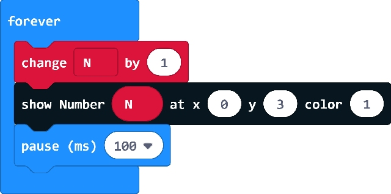

# OD01 pxt extension

XinaBox OD01 extension for makecode. Base on [OLED Package from microbit/micropython Chinese community](https://github.com/makecode-extensions/OLED12864_I2C).
  

## Demo

## License

MIT

Copyright (c) 2019, XinaBox  

## Supported targets

* for PXT/microbit

